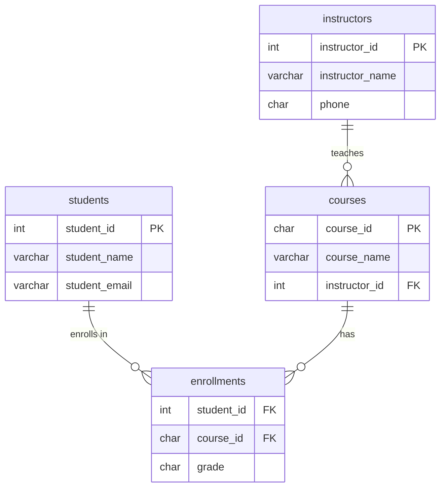

# Database Normalization

## Learning Objectives
- Explain what database normalization is and why it is a foundational skill for every relational database designer.
- Identify the problems caused by unnormalized data: update anomalies, insert anomalies, and delete anomalies.
- Apply **First Normal Form (1NF)**, **Second Normal Form (2NF)**, **Third Normal Form (3NF)**, and **Boyce-Codd Normal Form (BCNF)** to a given table.
- Recognize functional dependencies and use them as the analytical tool to drive normalization decisions.
- Understand the trade-off between normalization (data integrity) and denormalization (query performance).

---

## Why This Matters

Imagine you are a Java developer at a retail company. Your manager asks you to update the shipping address for a customer named "Jane Doe." You run an `UPDATE` statement. It works — but three months later, half the orders are shipping to Jane''s old address. Why? Because her address was duplicated across 47 rows and your `UPDATE` only changed one of them.

This scenario is called an **update anomaly**, and it is one of several severe data integrity problems that stem from poor database design. In the enterprise world, data corruption costs millions of dollars in lost business, failed audits, and emergency fixes.

**Normalization** is the formal, systematic process of organizing a relational database to minimize data redundancy and eliminate anomalies. It is not optional knowledge — it is the lens through which every professional database architect evaluates a schema.

This week, you have already learned how to model data with ERDs (Tuesday) and enforce business rules with constraints (today). Normalization is the next level: it tells you *how to structure your tables* so those constraints and relationships create a clean, maintainable system.

> We will revisit this concept when we study NoSQL databases in Week 3. There, you will learn that NoSQL systems deliberately *break* normalization rules (called **denormalization**) as a performance optimization. Understanding what you are breaking is what makes you a sophisticated engineer.

---

## The Concept

### Part 1: Anomalies — The Problems Normalization Solves

Before diving into the rules, you must clearly understand the three types of anomalies that unnormalized data produces.

Consider this single, flat table used by a small school to track student course enrollments:

| student_id | student_name | student_email    | course_id | course_name     | instructor    | instructor_phone |
|------------|--------------|------------------|-----------|-----------------|---------------|-----------------|
| 1          | Alice Chen   | alice@school.edu | CS101     | Intro to Java   | Prof. Smith   | 555-0100        |
| 1          | Alice Chen   | alice@school.edu | CS201     | Data Structures | Prof. Johnson | 555-0200        |
| 2          | Bob Marley   | bob@school.edu   | CS101     | Intro to Java   | Prof. Smith   | 555-0100        |
| 3          | Carol White  | carol@school.edu | CS301     | Databases       | Prof. Smith   | 555-0100        |

This table has serious problems:

#### Update Anomaly
Prof. Smith changes her phone number to `555-9999`. A developer must update **every row** that references her. If they miss even one row, the database is now inconsistent — two rows claim different phone numbers for the same instructor.

#### Insert Anomaly
A new course, "Machine Learning" (CS401), has been assigned to Prof. Davis, but no student has enrolled yet. You **cannot insert** this information into the table, because `student_id` is the primary key and it would be `NULL` — violating the primary key constraint.

#### Delete Anomaly
Carol White (student 3) withdraws from CS301. You delete her row. With it, you have accidentally deleted all knowledge that Prof. Smith teaches CS301 (Databases). The instructor-course relationship is permanently lost.

All three of these problems share the same root cause: **multiple, distinct facts are mixed together in the same table.** Normalization''s goal is to give each fact exactly one home.

---

### Part 2: Functional Dependencies

Before applying normalization rules, you need to understand **functional dependencies**, the mathematical foundation behind normalization.

> **Definition:** Column B is *functionally dependent* on column A if each unique value of A determines exactly one value of B.

**Notation:** `A → B` (read as "A determines B" or "B is functionally dependent on A")

**Examples from our school table:**
- `student_id → student_name` ✅ A student ID maps to exactly one name.
- `student_id → student_email` ✅ Each student has one email.
- `course_id → course_name` ✅ Each course ID maps to one course name.
- `course_id → instructor` ✅ Each course has one assigned instructor.
- `instructor → instructor_phone` ✅ Each instructor has one phone number.

**The composite key:** The primary key of our table is `(student_id, course_id)` — together they uniquely identify an enrollment row. But note that `student_name` is determined by `student_id` *alone*, not the full composite key. This is called a **partial dependency**, and it violates 2NF.

Understanding these dependency chains is what drives every normalization decision.

---

### Part 3: The Normal Forms

Think of normal forms as **levels of quality assurance** applied sequentially. You cannot achieve 3NF without first satisfying 1NF and 2NF.

---

#### 🔴 Unnormalized Form (UNF): The Starting Point

A table is in **Unnormalized Form** if it contains repeating groups, multi-valued columns, or no clear primary key.

**Example — UNF Table:** An order stored as a single row:

| order_id | customer_name | products                           |
|----------|---------------|------------------------------------|
| 1001     | Alice Chen    | "Laptop x1, Mouse x2, USB Hub x3" |
| 1002     | Bob Marley    | "Monitor x1"                       |

The `products` column stores a comma-separated list — a repeating group. There is no way to query "all orders containing a Laptop" without parsing the string in application code. This is a severe anti-pattern.

---

#### ✅ First Normal Form (1NF): Atomicity

> **Rule:** Every column must contain **atomic** (indivisible) values. No repeating groups or multi-valued attributes. Every row must be uniquely identifiable.

**The two key requirements:**
1. Each cell holds a single, indivisible value (no lists, no comma-separated values, no nested data).
2. There is a clear primary key identifying each row.

**Applying 1NF to the order example:**

Instead of storing products as a string, we expand each product onto its own row:

| order_id | customer_name | product_name | quantity |
|----------|---------------|--------------|----------|
| 1001     | Alice Chen    | Laptop       | 1        |
| 1001     | Alice Chen    | Mouse        | 2        |
| 1001     | Alice Chen    | USB Hub      | 3        |
| 1002     | Bob Marley    | Monitor      | 1        |

Primary Key: `(order_id, product_name)` — together they uniquely identify each row.

✅ The table is now in **1NF**: all cells are atomic, and each row is uniquely identifiable.

⚠️ But we still have a problem: `customer_name` depends only on `order_id`, not on the full composite key `(order_id, product_name)`. This is a **partial dependency** that will be resolved in 2NF.

---

#### ✅ Second Normal Form (2NF): Eliminate Partial Dependencies

> **Rule:** The table must be in 1NF **AND** every non-key column must depend on the **entire** primary key — not just part of it.

> **Note:** 2NF only applies to tables with a **composite primary key**. If your table has a single-column primary key, it automatically satisfies 2NF (assuming it is already in 1NF).

**What is a partial dependency?**
In the 1NF table above, the primary key is `(order_id, product_name)`. The column `customer_name` is determined by `order_id` alone:
- `order_id → customer_name` ← **Partial Dependency (violation!)**
- `(order_id, product_name) → quantity` ← ✅ Full dependency on the composite key.

**Fixing the partial dependency — Split the table:**

**Table 1: `orders`**

| order_id | customer_name |
|----------|---------------|
| 1001     | Alice Chen    |
| 1002     | Bob Marley    |

Primary Key: `order_id`

**Table 2: `order_items`**

| order_id | product_name | quantity |
|----------|--------------|----------|
| 1001     | Laptop       | 1        |
| 1001     | Mouse        | 2        |
| 1001     | USB Hub      | 3        |
| 1002     | Monitor      | 1        |

Primary Key: `(order_id, product_name)` | Foreign Key: `order_id → orders`

✅ Both tables are now in **2NF**: every non-key column depends on the full primary key.

---

#### ✅ Third Normal Form (3NF): Eliminate Transitive Dependencies

> **Rule:** The table must be in 2NF **AND** no non-key column must depend on *another non-key column*. Every non-key column must depend **directly** on the primary key.

This type of indirect dependency is called a **transitive dependency**.

**Let''s return to our school enrollment table** (now in 2NF):

**Table: `enrollments`** (PK: `(student_id, course_id)`)

| student_id | course_id | grade |
|------------|-----------|-------|
| 1          | CS101     | A     |
| 1          | CS201     | B     |
| 2          | CS101     | A-    |

**Table: `courses`** (PK: `course_id`)

| course_id | course_name     | instructor    | instructor_phone |
|-----------|-----------------|---------------|-----------------|
| CS101     | Intro to Java   | Prof. Smith   | 555-0100        |
| CS201     | Data Structures | Prof. Johnson | 555-0200        |
| CS301     | Databases       | Prof. Smith   | 555-0100        |

The `courses` table is in 2NF but **not** in 3NF. Look at the `instructor_phone` column:

- `course_id → instructor` ← Direct dependency ✅
- `instructor → instructor_phone` ← `instructor_phone` depends on a *non-key* column! ❌

**Chain:** `course_id → instructor → instructor_phone`

`instructor_phone` is **transitively dependent** on `course_id` through `instructor`. This causes the update anomaly we saw earlier.

**Fixing the transitive dependency — Split again:**

**Table: `courses`** (PK: `course_id`)

| course_id | course_name     | instructor_id |
|-----------|-----------------|---------------|
| CS101     | Intro to Java   | I01           |
| CS201     | Data Structures | I02           |
| CS301     | Databases       | I01           |

**Table: `instructors`** (PK: `instructor_id`)

| instructor_id | instructor_name | instructor_phone |
|---------------|-----------------|-----------------|
| I01           | Prof. Smith     | 555-0100        |
| I02           | Prof. Johnson   | 555-0200        |

✅ Both tables are now in **3NF**: every non-key column depends directly and only on the primary key.

Now when Prof. Smith changes her phone number, you update **exactly one row** in the `instructors` table.

---

#### ✅ Boyce-Codd Normal Form (BCNF): Closing the 3NF Loophole

> **Rule:** The table must be in 3NF **AND** for every functional dependency `A → B`, `A` must be a **superkey** (a key or superset of a key).

BCNF is a stricter version of 3NF. Most tables in 3NF are automatically in BCNF, but there is a subtle edge case when a table has **multiple overlapping candidate keys**.

**Example — Course-Advisor Scheduling:**

Consider a university where:
- Each student can have multiple advisors.
- Each advisor teaches only one subject.
- Each student is assigned at most one advisor per subject.

| student | subject | advisor      |
|---------|---------|--------------|
| Alice   | Math    | Prof. Brown  |
| Alice   | Physics | Prof. Green  |
| Bob     | Math    | Prof. White  |
| Carol   | Math    | Prof. Brown  |

**Candidate Keys:** `(student, subject)` and `(student, advisor)` both uniquely identify rows.

**Problem:** `advisor → subject` — an advisor determines a subject, but `advisor` is not a superkey. This is a BCNF violation.

**BCNF Fix — Split the table:**

**Table: `advisor_subjects`** (PK: `advisor`)

| advisor      | subject |
|--------------|---------|
| Prof. Brown  | Math    |
| Prof. Green  | Physics |
| Prof. White  | Math    |

**Table: `student_advisors`** (PK: `(student, advisor)`)

| student | advisor      |
|---------|--------------|
| Alice   | Prof. Brown  |
| Alice   | Prof. Green  |
| Bob     | Prof. White  |
| Carol   | Prof. Brown  |

✅ Now in **BCNF**: every determinant is a superkey.

---

### Part 4: Full Normalization Walkthrough in SQL

Taking our school table through all normal forms:

```sql
-- STEP 1: After applying 2NF — Separate partial dependencies

CREATE TABLE students (
    student_id    SERIAL       PRIMARY KEY,
    student_name  VARCHAR(100) NOT NULL,
    student_email VARCHAR(150) NOT NULL UNIQUE
);

-- STEP 2: After applying 3NF — Extract instructors to remove transitive dependency

CREATE TABLE instructors (
    instructor_id   SERIAL       PRIMARY KEY,
    instructor_name VARCHAR(100) NOT NULL,
    phone           CHAR(10)
);

CREATE TABLE courses (
    course_id     CHAR(5)      PRIMARY KEY,
    course_name   VARCHAR(100) NOT NULL,
    instructor_id INT          NOT NULL REFERENCES instructors(instructor_id)
);

-- Enrollments: depends on the FULL composite key (student_id + course_id)
CREATE TABLE enrollments (
    student_id INT     NOT NULL REFERENCES students(student_id),
    course_id  CHAR(5) NOT NULL REFERENCES courses(course_id),
    grade      CHAR(2),
    PRIMARY KEY (student_id, course_id)
);
```

**Inserting sample data:**

```sql
INSERT INTO instructors (instructor_name, phone) VALUES
    ('Prof. Smith',   '555-0100'),
    ('Prof. Johnson', '555-0200');

INSERT INTO courses (course_id, course_name, instructor_id) VALUES
    ('CS101', 'Intro to Java',   1),
    ('CS201', 'Data Structures', 2),
    ('CS301', 'Databases',       1);

INSERT INTO students (student_name, student_email) VALUES
    ('Alice Chen',  'alice@school.edu'),
    ('Bob Marley',  'bob@school.edu'),
    ('Carol White', 'carol@school.edu');

INSERT INTO enrollments (student_id, course_id, grade) VALUES
    (1, 'CS101', 'A'),
    (1, 'CS201', 'B'),
    (2, 'CS101', 'A-'),
    (3, 'CS301', 'B+');
```

**The resulting fully normalized ERD:**



**Querying the normalized schema:**

```sql
-- Reconstruct the original flat view by joining all four tables
SELECT
    s.student_id,
    s.student_name,
    s.student_email,
    c.course_id,
    c.course_name,
    i.instructor_name,
    i.phone AS instructor_phone,
    e.grade
FROM enrollments e
JOIN students    s ON e.student_id   = s.student_id
JOIN courses     c ON e.course_id    = c.course_id
JOIN instructors i ON c.instructor_id = i.instructor_id
ORDER BY s.student_id, c.course_id;
```

> **Note:** You will cover JOINs in full depth on Friday. For now, recognize that normalization *requires* joins to reconstruct related data — and this is by design.

---

### Part 5: Normalization vs. Denormalization — The Trade-Off

Normalization is not always the final answer. In practice, engineers make deliberate decisions about when to normalize and when to *denormalize*.

| Factor               | Normalized Schema                      | Denormalized Schema                      |
|----------------------|----------------------------------------|------------------------------------------|
| **Data Integrity**   | ✅ Excellent — single source of truth  | ⚠️ Risk of inconsistency                 |
| **Storage**          | ✅ Minimal — no redundancy             | ⚠️ Higher — data is duplicated           |
| **Write Performance**| ✅ Faster — update one row             | ⚠️ Slower — must update many rows        |
| **Read Performance** | ⚠️ Slower — requires JOINs            | ✅ Faster — data is pre-joined           |
| **Query Complexity** | ⚠️ Higher — more JOINs               | ✅ Simpler — fewer or no JOINs           |
| **Best Use Case**    | OLTP (transactional apps, APIs)        | OLAP (analytics, data warehouses)        |

**OLTP (Online Transaction Processing):** Your typical full-stack Java backend. Data integrity is paramount. Normalize to 3NF.

**OLAP (Online Analytical Processing):** Reporting dashboards and data warehouses (e.g., Amazon Redshift, which we will cover in Week 3). Analytics queries read millions of rows; joins become bottlenecks. Denormalize to optimize reads.

> As a professional full-stack developer, you will apply **3NF normalization** to your transactional databases. You will encounter denormalization strategies when you reach data warehousing in Week 3.

---

## Summary

| Normal Form | Rule                                           | Problem Solved             |
|-------------|------------------------------------------------|----------------------------|
| **1NF**     | Atomic values, no repeating groups             | Parsing/querying issues    |
| **2NF**     | No partial dependencies on composite PK        | Redundant non-key data     |
| **3NF**     | No transitive dependencies (non-key → non-key) | Update/delete anomalies    |
| **BCNF**    | Every determinant must be a superkey           | Overlapping candidate keys |

**Key Takeaways:**
- The three database anomalies — **update**, **insert**, and **delete** — are the root motivation for normalization.
- **Functional dependencies** (`A → B`) are the analytical tool used to identify normalization violations.
- Apply normal forms **sequentially**: 1NF → 2NF → 3NF → BCNF.
- **3NF is the industry-standard target** for transactional OLTP systems.
- Normalization trades **read simplicity** (more JOINs) for **write correctness** (one source of truth). Denormalization is a deliberate optimization decision, not an accident.

---

## Additional Resources
- [Database Normalization Explained - NovaTec Blog](https://www.novatec-gmbh.de/en/blog/normalization-of-relational-databases/)
- [PostgreSQL Tutorial: Database Normalization](https://www.postgresqltutorial.com/postgresql-tutorial/database-normalization/)
- [First, Second, and Third Normal Form — W3Schools](https://www.w3schools.com/sql/sql_normalization.asp)
